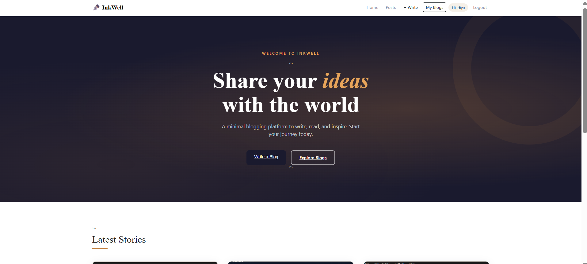
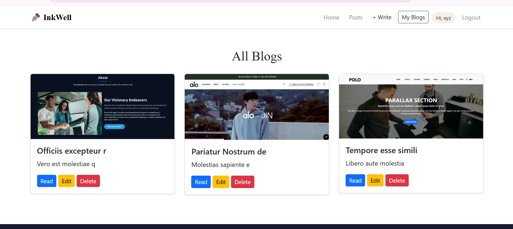

# 📝 InkWell - Blog Management System

A full-stack **Blog Management Web Application** built using **Node.js, Express, MongoDB, EJS, and Passport.js Authentication**.

This project allows users to register, login, create blogs, upload images, edit, and delete their own blogs.

---

## 🚀 Features

* 🔐 User Authentication (Register / Login / Logout)
* 🔑 Secure Password Hashing (bcrypt)
* 📝 Create Blog with Image Upload
* 📄 View All Blogs
* 👤 User-specific Blog Management (My Blogs)
* ✏️ Edit Blog
* ❌ Delete Blog
* 📷 Image Upload using Multer
* 🎨 Responsive UI with EJS Templates

---

## 🛠️ Tech Stack

* Backend: Node.js, Express.js
* Database: MongoDB Atlas + Mongoose
* Frontend: EJS, Bootstrap
* Authentication: Passport.js (Local Strategy)
* File Upload: Multer

---

## 📂 Project Structure

```
project/
│── controllers/
│── models/
│── routes/
│── middlewares/
│── public/
│── views/
│    ├── pages/
│    └── partials/
│── config/
│── .env
│── index.js
```

---

## ⚙️ Installation & Setup

### 1️⃣ Clone Repository

```
git clone https://github.com/dev-dhamandadiya/Login-System-With-Blog-Project.node.JS.git
```

---

### 2️⃣ Install Dependencies

```
npm install
```

---

### 3️⃣ Setup Environment Variables (.env)

```
PORT=8081
MONGO_URI=your_mongodb_connection_string
SESSION_SECRET=superSecret123
```

---

### 4️⃣ Run Project

```
npm run dev
```

or

```
node index.js
```

---

## 🌐 Application URL

```
http://localhost:8081
```

---
## 📸 Screenshots

### 🏠 Home Page


### ➕ Add Blog


### 📚 All Blogs


## 🔒 Authentication Flow

* User registers → account created
* User logs in → session created
* Access protected routes
* Logout destroys session

---

## 📌 Important Routes

| Route                  | Method | Description   |
| ---------------------- | ------ | ------------- |
| /register              | GET    | Register Page |
| /login                 | GET    | Login Page    |
| /blog                  | GET    | All Blogs     |
| /my-blogs              | GET    | User Blogs    |
| /admin/add-blog        | GET    | Add Blog Page |
| /admin/edit-blog/:id   | GET    | Edit Blog     |
| /admin/delete-blog/:id | POST   | Delete Blog   |

---

## 🧠 Learnings

* Authentication using Passport.js
* File uploads with Multer
* MVC Architecture in Node.js
* MongoDB Atlas integration
* Session management

---

## 💡 Future Improvements

* ❤️ Like / Comment System
* 🔍 Search & Filter Blogs
* 📱 Mobile Optimization
* 🌐 Deployment (Render / Vercel)

---

## 👨‍💻 Author

**Diya Hoshiyarsingh Dhamanda

---

## ⭐ Support

If you like this project, give it a ⭐ on GitHub!

---
